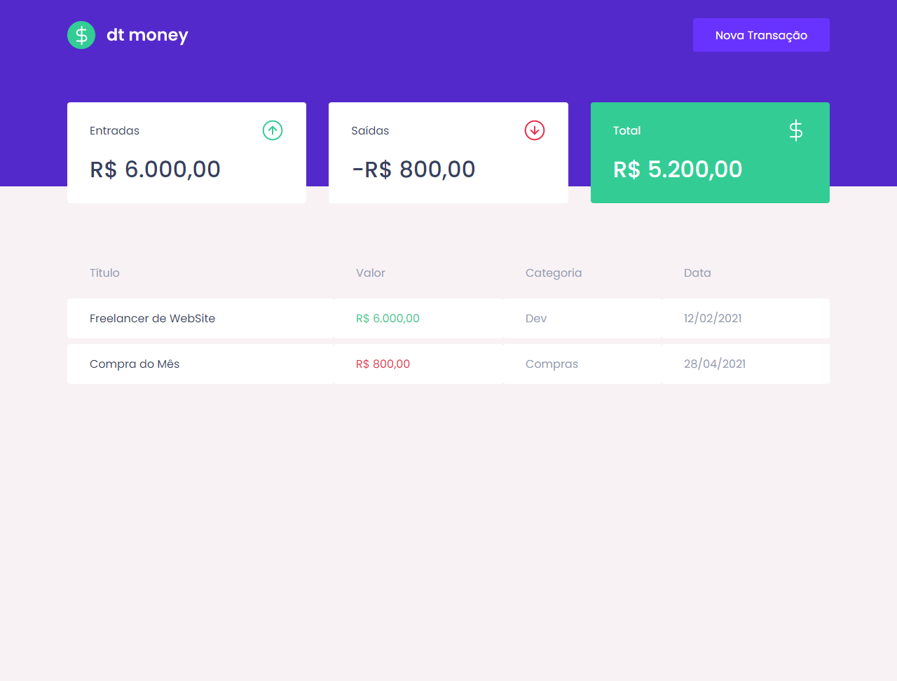
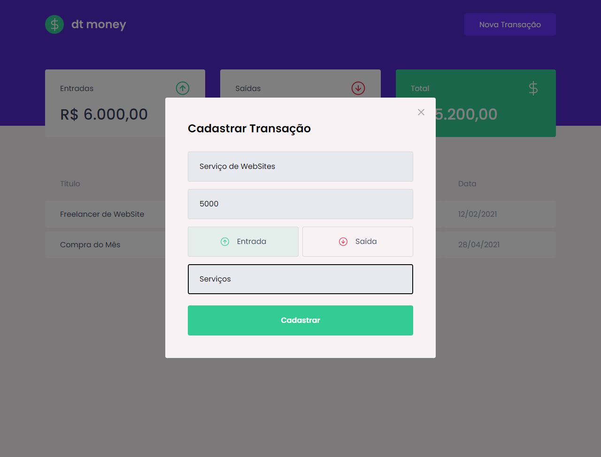

<div align="center">
  
</div>

<h1 align="center"> RocketSeat - Ignite ReactJS 🔥</h1>


<h2 align="center"> Módulo 2 - Primeira aplicação web com React ( DT Money ) </h2>


<!-- Sobre o Projeto -->
## 🚀 Sobre o Projeto
DT Money é um controle de contas financeiro pessoal que cadastra contas de entrada e saída, totaliza em cards utilizando uma biblioteca de Fake API MirajeJS que utiliza o formato JSON para fazer os cadastros. 

## 🖼️ Imagens do Projeto
<div align="center">
  
</div>
<div align="center">
  
</div>
<div align="center">
  
</div>

## Tecnologias e Bibliotecas

* [ReactJS](https://pt-br.reactjs.org/tutorial/tutorial.html)
  * [Styled Component](https://www.npmjs.com/package/styled-components) - Biblioteca CSS in JS
  * [Axios](https://www.npmjs.com/package/axios)
  * [React Modal](https://www.npmjs.com/package/react-modal)
  * [Polished](https://www.npmjs.com/package/polished)
* [TypeScript](https://www.typescriptlang.org/)
* [MirageJS]()

## ⚙️ Rodando o Projeto
```bash
# Clone este repositório
$ git clone https://github.com/Claytonrss/rocketseat-ignite-dt-money.git

# Acesse a pasta rocketseat-ignite-dt-money
$ cd rocketseat-ignite-dt-money

# Instale as dependências
$ yarn

# Executando o Projeto
$ yarn start

# Acesse http://localhost:3000 no seu navegador
```
